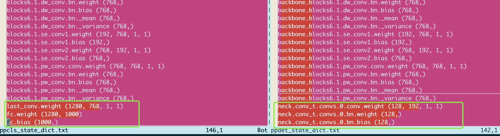

# PaddleClas预训练权重转PaddleDetection中Backbone权重

## 环境依赖
- PaddlePaddle

## 1.准备模型
首先需要准备PaddleClas中预训练权重，以及PaddleDetection中模型权重，如果初次开发检测模型，可先不加载权重，直接使用`tools/train.py`训练少量轮数保存一个权重。（主要为了匹配weight name）

比如，这里提供了LCNet的相关模型权重：
```
# 分类模型
wget https://paddle-imagenet-models-name.bj.bcebos.com/dygraph/legendary_models/PPLCNet_x1_5_pretrained.pdparams
# 检测模型
wget https://paddledet.bj.bcebos.com/models/picodet_lcnet_1_5x_416_coco.pdparams
```

### 2.生成匹配映射list

通过执行match_weight_name.py:

```
python3.7 match_weight_name.py PPLCNet_x1_5_pretrained.pdparams picodet_lcnet_1_5x_416_coco.pdparams
```

产出`ppcls_state_dict.txt` 和 `ppdet_state_dict.txt`两个txt文件，分别是weight name的列表。
然后查看weight name的对应diff，确认两个文件每一行的weight都能对应一致：（名字前缀等可不相同）

```
vimdiff ppcls_state_dict.txt ppdet_state_dict.txt
```
有多余的weight等在txt中直接删除相应行即可。

<div align="center">
  
</div>

最终的txt可参考[ppcls_state_dict.txt](./ppcls_state_dict.txt) 和 [ppdet_state_dict.txt](./ppdet_state_dict.txt)

### 3.生成最终ppdet模型

```
python3.7 convert_paddle.py PPLCNet_x1_5_pretrained.pdparams ppcls_state_dict.txt ppdet_state_dict.txt PPLCNet_x1_5_pretrained_new.pdparams
```

此时就生成了使用于Paddledetection模型backbone的预训练权重：`PPLCNet_x1_5_pretrained_new.pdparams`
